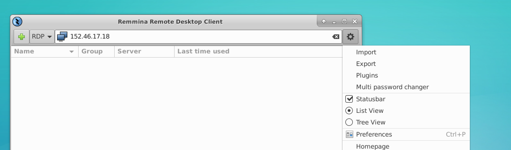
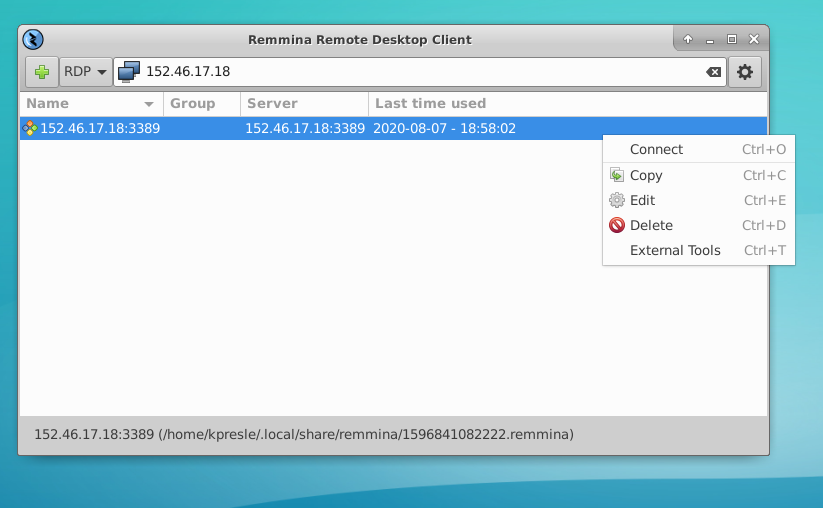
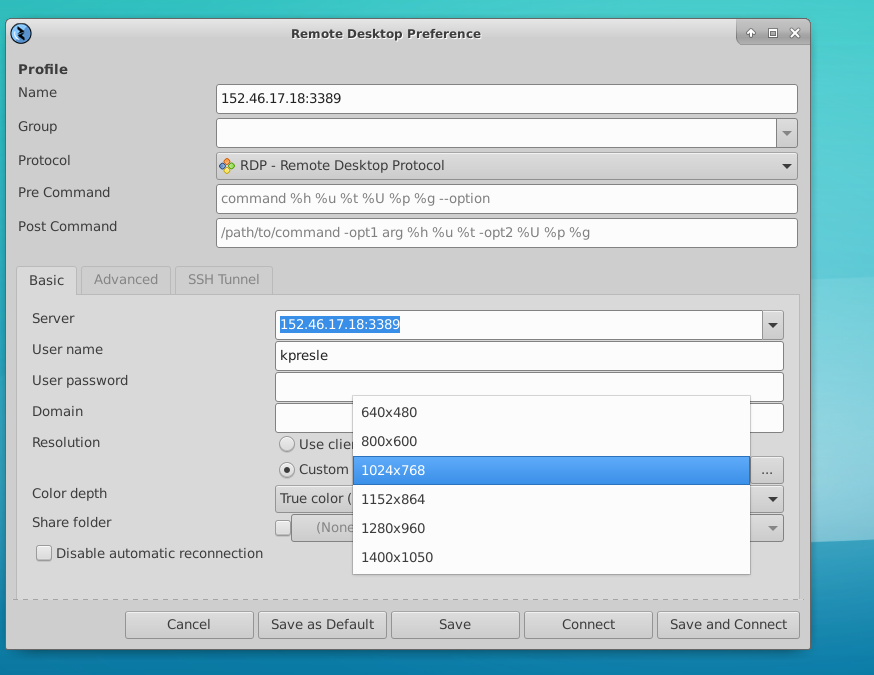
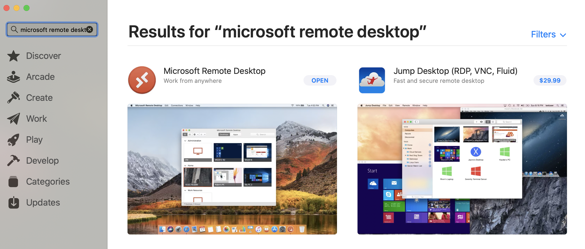
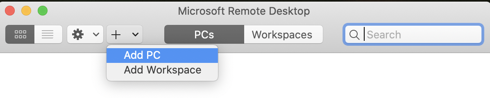
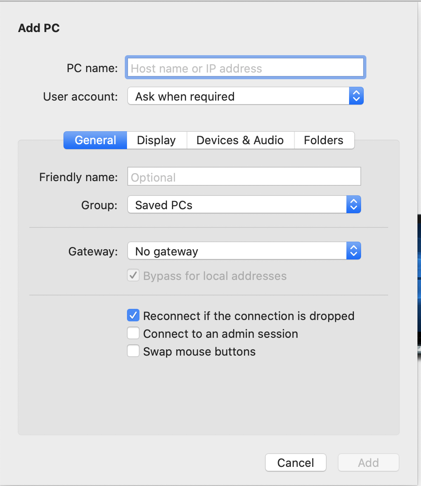
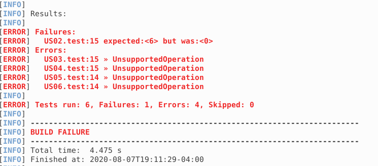
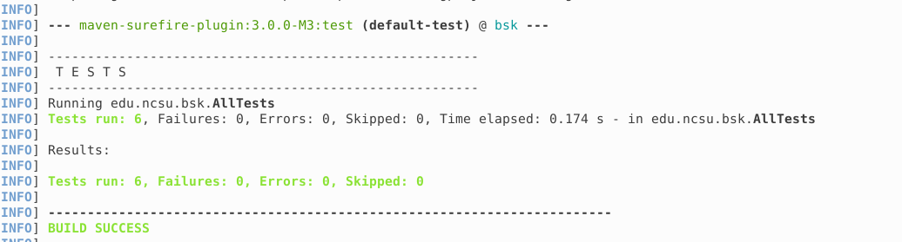

# Setup Instructions - BSK

You are going to be writing code to make a set of tests pass in an assigned VM. There is a very specific way we are asking you to run the tests so can can capture information about your progress through this exercise. 

Follow along with **[the video](https://youtu.be/qWX7zUq7N-I)** or a full copy of the instructions is available [here](files/Instructions.docx) of the instructions. Here are some links/text that might help along the way. 

1. [NCSU VCL](https://vcl.ncsu.edu/)
1. Command line for starting eclipse: ```eclipse &```
1. Default workspace in eclipse: ```/opt/eclipse-ws/```
1. Terminal command to get to test files: ```/opt/eclipse-ws/testingproject```
1. Terminal command to launch the project: ```cs bsk``` then ```ls -al``` then ```./runner.sh```
1. Terminal command to fully recompile the project: ```cd /opt/eclipse-ws/testingproject/bsk``` then ```sudo mvn clean``` **Note: Follow these two steps if the ```Maven > Update Project``` does not download the project dependencies in the Eclipse**

## Instructions

If you're connecting from a Linux computer, you won't have the Microsoft Remote Desktop Client.  Instead, we encourage you to install Remmina (available by default on modern version of Ubuntu/Linux Mint, otherwise the package is `remmina-plugin-rdp` and the command to run is `remmina`).

First, download the RDP file from VCL.  After launching Remmina, click the gear icon in the top right, then Import:



Browse to the location of your RDP file (probably `/home/<you>/Downloads`) and import it:



Then, right-click on the server listed, and select Edit, and change the screen resolution to be higher:



Finally, click Save & Connect and then proceed as before.


If you're on a Mac, download Microsoft Remote Desktop from the App Store:



After installing and launching, click the Plus icon, then Add PC:



Finally, enter in the IP address of your VM, change your display settings as desired, and click Add:




### How do I know that I'm making progress? 

When you start the project, all of the tests will be failing.  As you make progress through the implementation, some of the tests will start passing:




### How do I know that I'm done?

When you're done, all of the tests will pass, and you'll get a green "BUILD SUCCESS" indicating everything worked:


